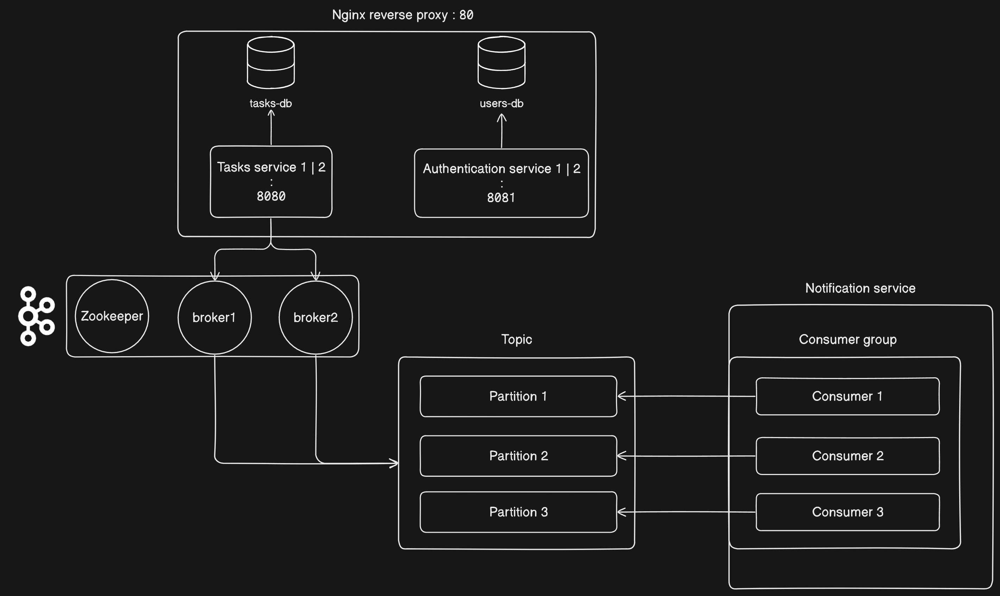

A microservice architecture implying 3 services:
- An authentication service registering and logging users (protects the routes with JWT's)
- A  task tracking service that handles managing the tasks of an user
- A notification service that checks periodically for deadlines using the Kafka Producer/Consumer pattern.

The load-balancing and failover is managed by a Nginx reverse proxy.

